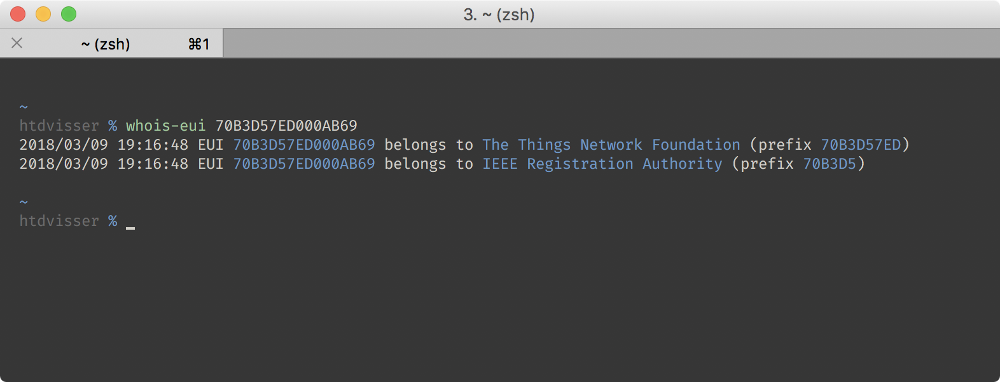

# EUI Lookup

In case you want to know who registered an EUI.

## CLI Usage

- Installation: `go get go.htdvisser.nl/eui/cmd/whois-eui`
- Initialize the database: `whois-eui -initialize`
- Do an EUI lookup: `whois-eui 70B3D57ED000AB69`
